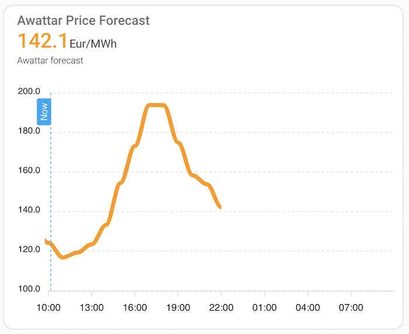

# Homeassistant integration for Energy Price Forecast

[](https://github.com/hacs/integration)

This is an integration for the Home Assistant for the price forecast using [this library](https://github.com/openkfw/smartenergy.awattar-api).

## How to use it

### HACS

1. Open your Home Assistant in a browser.
2. In case you don't have HACS, follow the steps from here <https://hacs.xyz/docs/configuration/basic>.
3. In the left menu you should have HACS icon, click it.
4. Click on `Integrations` -> click 3 dots top right corner -> click `Custom repositories`.
5. In the dialog window, add `https://github.com/openkfw/smartenergy.awattar` as a repository and select `Integration` as a category.
6. Click `ADD`, wait for spinner to finish and close the dialog.
7. Click `EXPLORE & DOWNLOAD REPOSITORIES` -> search for `Awattar` -> select the `Awattar -> wait and click `DOWNLOAD`.
8. Go to Settings -> System -> click `RESTART` and wait few seconds.
9. Go to Settings -> Devices & Services. Click the `ADD INTEGRATION` button.
10. Search for `Awattar` -> click -> fill in details -> click `SUBMIT`.

Example config:

TBD

> Make sure that there is no trailing slash in the API host, otherwise the validation fails. When pressing submit, validation will also check the connectivity and fails if not able to connect and authenticate.

11. Go to the dashboard screen, you should see bunch of sensors for the Awattar integration.

### Example Lovelace card

Since the forecast is an array of values, it's not possible to nicely display by default as a card. However, you can install this integration <https://github.com/RomRider/apexcharts-card>. In the card configuration provide:

```yaml
type: custom:apexcharts-card
graph_span: 1d
span:
  start: hour
header:
  show: true
  title: Awattar Price Forecast
  show_states: true
  colorize_states: true
now:
  show: true
  label: Now
series:
  - entity: sensor.smartenergy_awattar_forecast
    data_generator: |
      return entity.attributes.forecast.map((f, index) => {
        return [f.start_time, f.marketprice];
      });
```

Outcome should look like this:



## Features

### Sensors

| Name                           | Attributes | Description                                                                                    |
| ------------------------------ | ---------- | ---------------------------------------------------------------------------------------------- |
| `smartenergy_awattar_forecast` | `forecast` | Sensor having the `forecast` attribute containing the 24 hour forecast for the Awattar prices. |

### Configuration

The integration can be configured either via UI (config flow) as described in the [How to use it - HACS section](#hacs) or via `configuration.yaml`. For example:

```yaml
smartenergy_awattar:
  country: de
```

## Development

In case you are interested in development, check the guide [here](./docs/dev.md).
